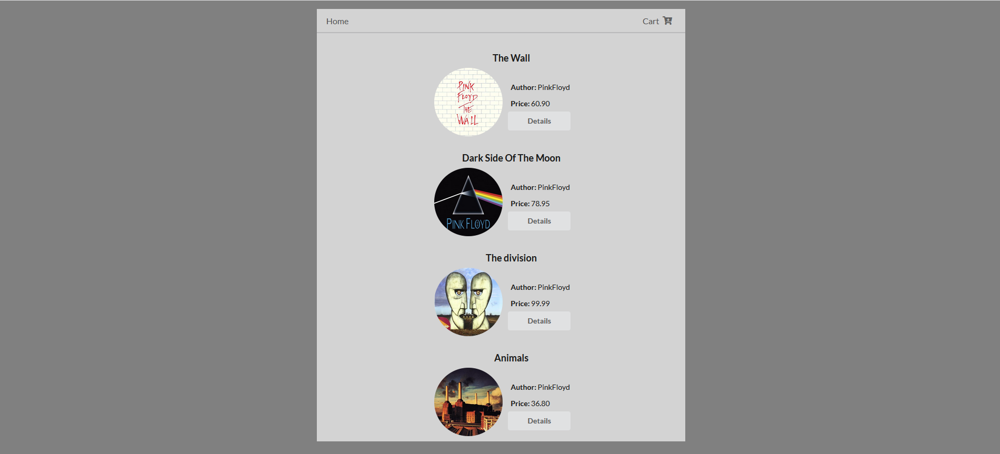
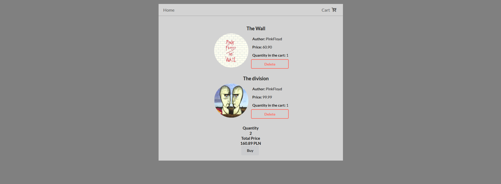
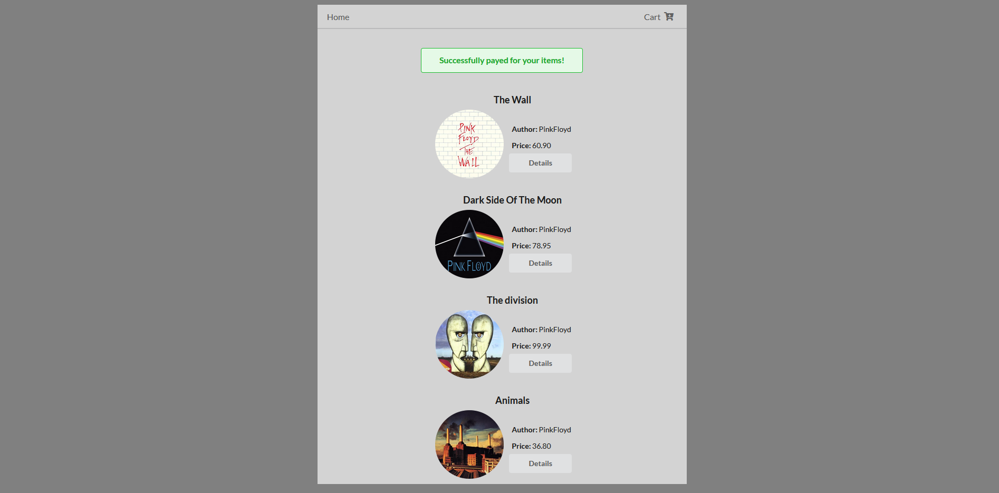

# PHP_SHOP
Simple shop app with database connection.
**Technologies**
**Back**:
* PHP
* Myql

**Front**:
* CSS3
* Html5
      
## Setup
To run the project, you have to install xampp, then run Mysql and Apache Modules.
You will have to create database first with name "bazasklep".
If you need to change the database connection values, you can do it in data.php
## Usage
### Main

### Product details

### Added to cart

### Deleted product

### Attempt to buy items

### Bought items

